# SQL for Data Analysis

## PostgreSQL 설치
- 다운로드: 아래 링크 중 하나에서 본인의 운영체제에 맞는 PostgreSQL을 다운로드하여 설치하세요.
  - https://www.postgresql.org/download/
  - https://www.enterprisedb.com/downloads/postgres-postgresql-downloads
- 이 책의 실습 코드는 **PostgreSQL 14.2**에서 테스트 되었습니다.

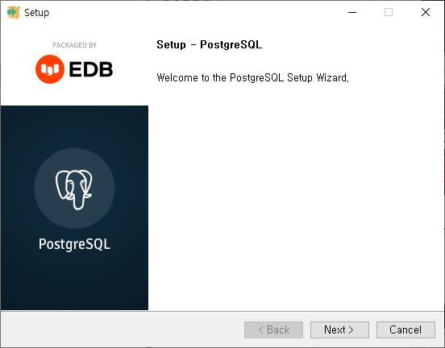
```
1. 다운로드 한 설치파일을 실행하면 위와 같은 화면이 나옵니다.
```

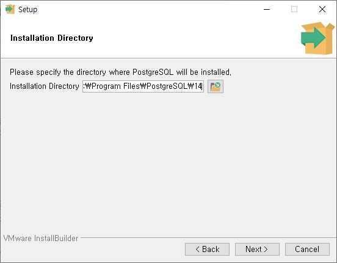
```
2. 설치 경로를 지정합니다. 기본 경로를 그대로 사용하겠습니다.
```

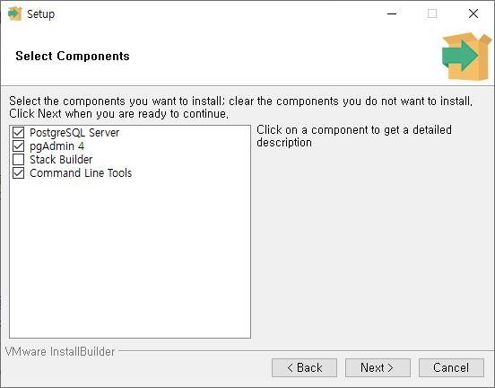
```
3. PostgreSQL 서버, pgAdmin 4, Command Line Tools만 설치하겠습니다.
```

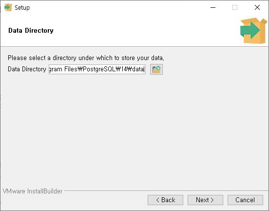
```
4. 데이터를 저장할 경로를 지정합니다. 기본 경로를 그대로 사용하겠습니다.
```

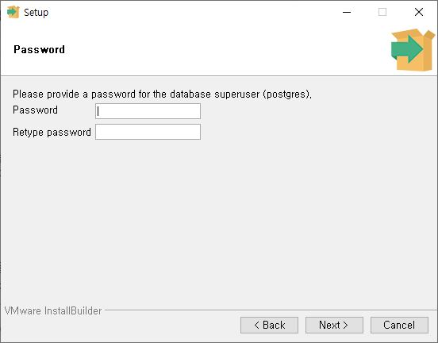
```
5. PostgreSQL에 접속할 때 사용할 비밀번호를 생성합니다.
```


```
6. PostgreSQL 서버의 포트 번호를 지정합니다. 기본 포트를 그대로 사용하겠습니다.
```

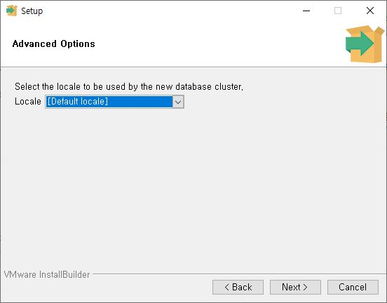
```
7. 지역값을 지정합니다. 기본 지역값을 그대로 사용하겠습니다.
```

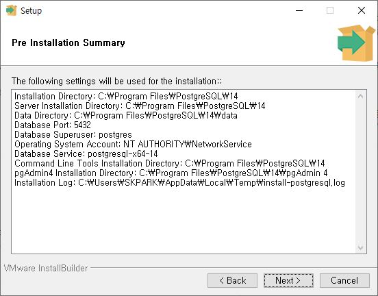
```
8. 설치할 내용을 다시 한 번 확인합니다.
```

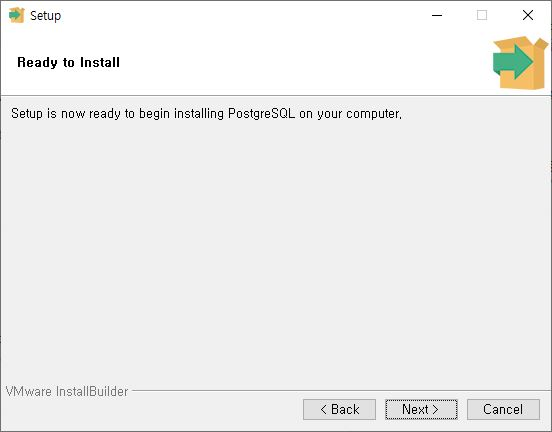
```
9. 이제 모든 설치 준비가 끝났습니다. [Next]를 눌러 설치를 시작합니다.
```

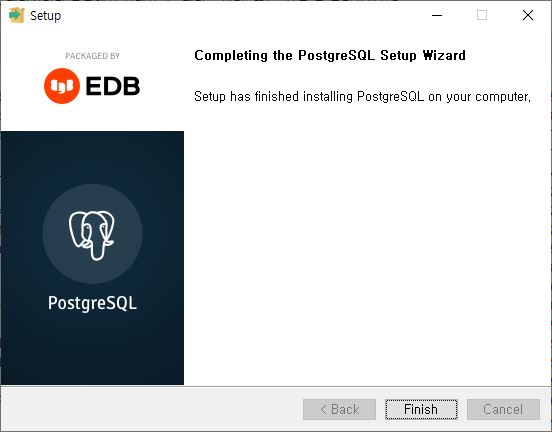
```
10. 설치가 완료되었습니다.
```

## PostgreSQL 실행
- 여기서는 PostgreSQL을 설치할 때 함께 설치했던 PostgreSQL 관리 도구인 **pgAdmin 4**을 사용하여 실습하는 방법을 설명합니다.
- **pgAdmin 4** 외에, **HeidiSQL**(https://www.heidisql.com/) 등의 다른 GUI 기반 데이터베이스 관리 도구를 사용해도 좋습니다.

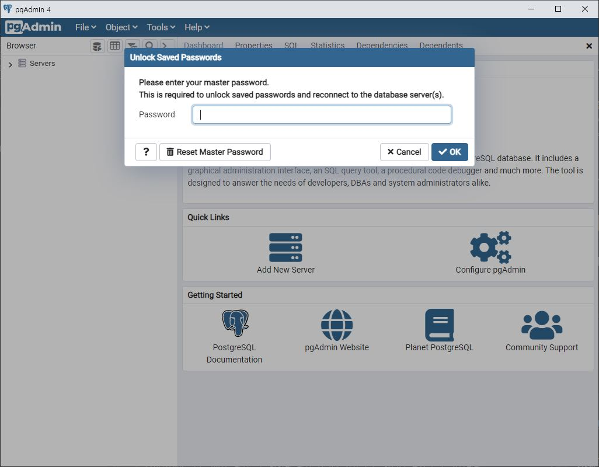
```
1. 설치된 pgAdmin 4를 실행하고, 설치할 때 생성한 비밀번호를 입력합니다.
```


```
2. 다시 한번 비밀번호를 입력합니다.
```

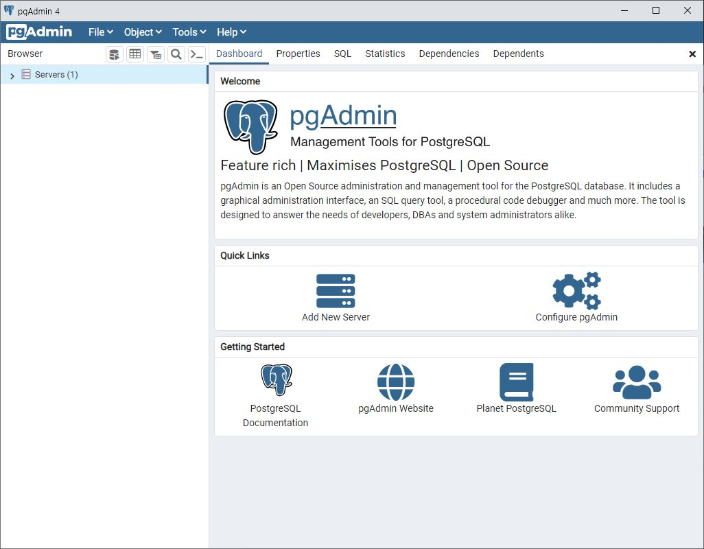
```
3. 화면 중앙의 Add New Server를 클릭합니다.
```

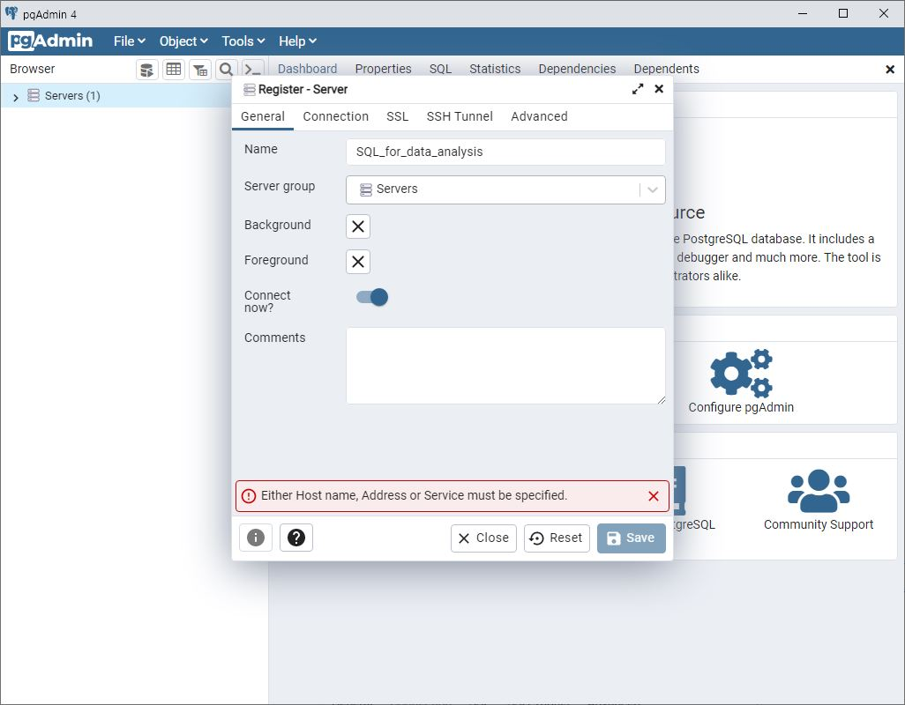
```
4. 새로 생성할 PostgreSQL 서버의 이름을 입력합니다. 
여기서는 SQL_for_data_analysis를 입력하였습니다.
```

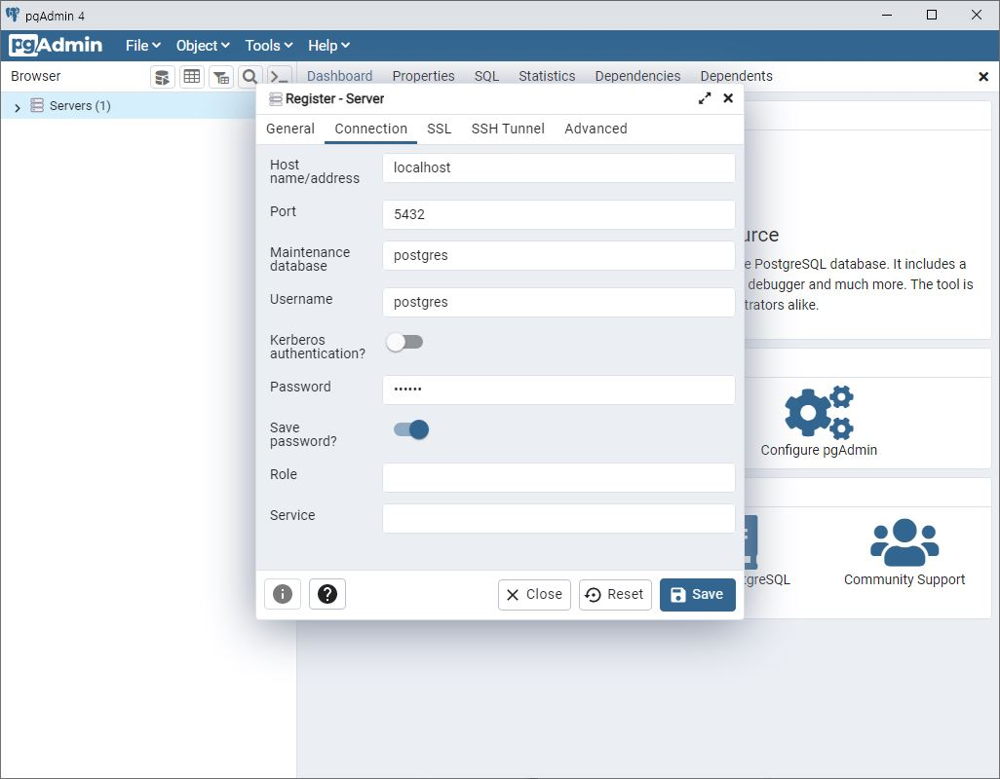
```
5. Connection 탭으로 이동하여 Host 주소에 localhost를 입력하고, Password에 비밀번호를 입력합니다. 
Save password? 를 선택하면 다음 접속부터 비밀번호를 묻지 않습니다. Save 버튼을 클릭합니다.
```

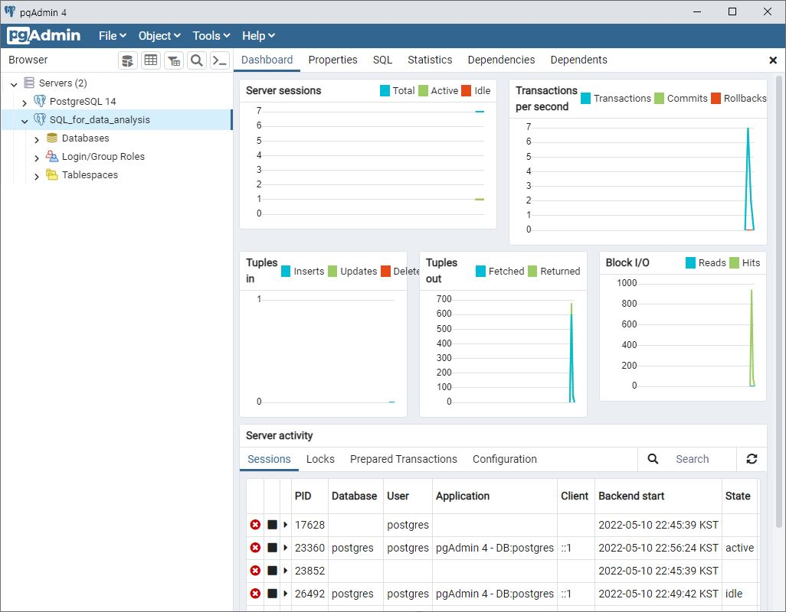
```
6. SQL_for_data_analysis라는 이름의 새로운 서버가 생성되었습니다.
```
                                  

```
7. 새로 생성한 서버의 데이터베이스 아래 postgres에서 마우스 우클릭하여 Query Tool을 선택하면 
쿼리 에디터를 열 수 있습니다.
```


```
8. Chapter 2_데이터 준비 폴더에 있는 create_date_dimension_table.sql 파일을 참고하여, 
날짜 차원 테이블을 생성하는 코드를 입력하고, 우측 상단의 실행 버튼을 클릭합니다.
```


```
9. 쿼리가 정상적으로 실행되었다는 메시지를 확인할 수 있습니다.
``` 

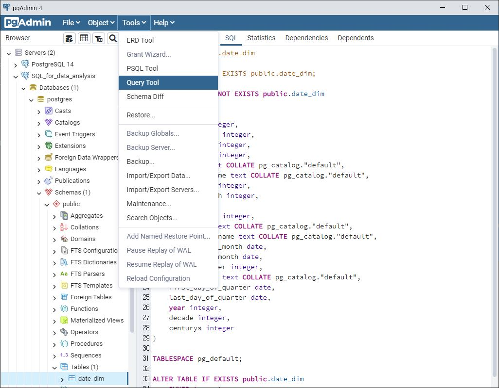
```
10. 상단의 메뉴: [Tools]-[Query Tool]을 통해서도 쿼리 에디터를 열 수 있습니다.
```

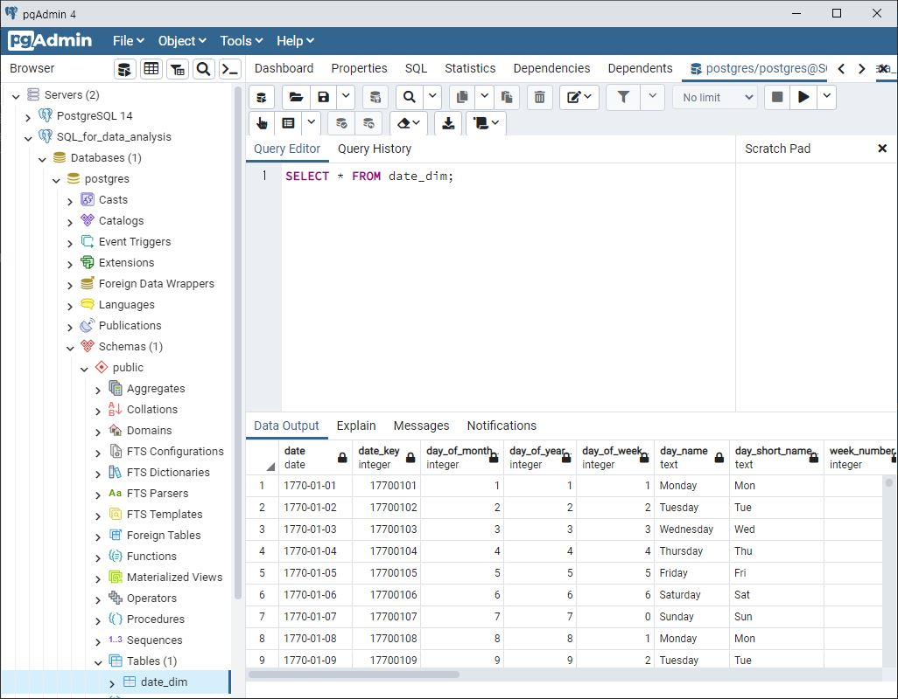
```
11. SELECT * FROM date_dim; 을 실행하면, 
Data Output 탭에서 방금 생성한 날짜 차원 테이블의 데이터를 확인할 수 있습니다.
```

## 문제 해결

### 데이터 테이블 생성시 문제 해결
```
오류: 0xe2 0x80 바이트로 조합된 문자(인코딩: "UHC")와 대응되는 문자 코드가 "UTF8" 인코딩에는 없습니다
```
위와 같은 오류가 발생하는 경우 별도의 인코딩 설정이 필요합니다.

```sql
SHOW server_encoding; -- 현재 PostgreSQL 서버의 인코딩을 확인합니다.
SHOW client_encoding; -- 현재 클라이언트의 인코딩을 확인합니다.
```
여기서 서버의 인코딩과 클라이언트의 인코딩이 다른 경우 인코딩 문제가 발생합니다.
서버의 인코딩은 UTF8인데 클라이언트의 인코딩이 UHC인 경우 이런 문제가 발생할 수 있습니다.

```sql
SET client_encoding to 'UTF8'; -- 클라이언트의 인코딩을 UTF8로 설정합니다.
SHOW client_encoding; -- 이제 UTF8로 바뀐 것을 확인할 수 있습니다.
```
이제 서버의 인코딩과 클라이언트의 인코딩이 모두 UTF8로 일치하게 되었습니다.
다시 테이블 생성 코드를 실행하면 문제없이 데이터 테이블을 생성할 수 있습니다.


### SQL 실행시 문제 해결
```
오류:  날짜/시간 필드의 값이 범위를 벗어남: "1/1/1947 17:00"
힌트:  날짜 표현 방식("datestyle")을 다른 것으로 사용하고 있는 듯 합니다.
```
TIMESTAMP 또는 DATE 타입으로 데이터 타입 변환시 위와 같은 에러가 발생할 수 있습니다.
컴퓨터는 연도/월/일의 형식으로 문자열이 저장되어 있다고 판단하지만,
실제 값은 월/일/연도의 형식으로 저장되어 있기 때문에 위와 같은 오류가 발생합니다.
이때는 아래 명령어를 실행하여 현재 날짜 형식으로 저장된 문자열이 월/일/연도의 형식으로 저장되어 있다는 것을 명시해야 합니다.

```sql
SET datestyle = mdy; -- 월/일/연도(month/day/year)
```
현재 저장된 날짜 형식의 문자열이 월/일/연도(month/day/year)의 형식으로 저장되어 있음을 명시하였습니다.
다음 다시 데이터 타입 변환 쿼리를 실행하면 오류없이 실행할 수 있습니다.
